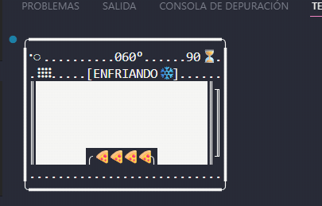

# Practica Python

Este repositorio contiene ejercicios, scripts y proyectos de programación en Python, incluyendo ejemplos educativos, automatización y utilidades varias.


##
- `Duoc programacion/` — Ejercicios prácticos y guías de programación
	- Incluye simulaciones de situaciones, como el control de semáforos, sistemas de seguridad y automatización de tareas cotidianas. También hay ejercicios donde se prueban ideas, se resuelven problemas y se automatizan cálculos, diseño para mejorar procesos y buscar soluciones prácticas.


## Ejemplos de simulaciones en consola

A continuación se muestran algunos ejemplos visuales de simulaciones realizadas en este repositorio. Estas simulaciones ayudan a entender y practicar la lógica de control de procesos y la representación visual de sistemas en la terminal.

### Horno pizzeria simulado


*Animación: Ejecución del horno pizza en la terminal.*

[Ver código fuente del simulador (HORNO_Completo.py)](Duoc_programacion/0_Guias_y_Ejercicios_GPIO_py_pseint/4_Diseños_GPIOy_CLI/Ejecicio_Extra_Horno/HORNO_Completo.py)

---

### Sistema de seguridad simulado

*La puerta solo se abre automáticamente en el dia; fuera de ese horario permanece cerrada. La alarma y las luces se activan ante eventos de movimiento o sonido.*

**Estados del sistema:**
- **Puerta:** Abierta (madrugada) / Cerrada (día)
- **Luces:** Encendidas (evento) / Apagadas (normal)
- **Alarma:** ON (evento) / OFF (normal)
- **Movimiento:** SÍ / NO
- **Sonido:** ALTO / NORMAL

```
╔══════════════════════════════╗
║  SISTEMA DE SEGURIDAD        ║
║  [Puerta: CERRADA]           ║
║  [Luces: APAGADAS]           ║
║  [Alarma: ON]                ║
║  [Movimiento: NO]            ║
║  [Sonido: NORMAL]            ║
╚══════════════════════════════╝
```
*Figura: Estado típico del sistema de seguridad en consola.*

[Ver código fuente del sistema de seguridad simulado (Sistemade_seguridad_Simulado.py)](Duoc_programacion/0_Guias_y_Ejercicios_GPIO_py_pseint/4_Diseños_GPIOy_CLI/Sistemade_seguridad_Simulado.py)

---

- `Config cisco/` — Configuraciones y guías de redes Cisco
- `Coursera python IT/` — Ejercicios y tareas de cursos de Python
- `Elmercurio_webScraper/` — Scripts de scraping y automatización web
- `ruby/` — Scripts en Ruby


